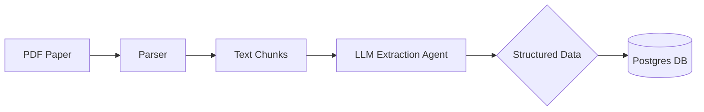

# System Design Document

## 1. System Architecture

### Overview
The system is an agentic backend designed to ingest academic research papers, extract structured knowledge (entities and relationships), and store them in a graph-structured relational database (Postgres).

### Key Components
1.  **Ingestion Layer**:
    *   **Input**: PDF files from a local directory (`papers/`).
    *   **Parser**: `pdf-parse` converts raw PDF binary to text.
    *   **Preprocessor**: Cleans and formats text (markdown-like structure) to optimize for LLM context windows.

2.  **Agentic Extraction Layer (LangGraph)**:
    *   **Model**: Anthropic Claude 3 Haiku (chosen for speed and cost-efficiency).
    *   **Orchestrator**: `LangGraph` manages the workflow state.
    *   **Logic**: A structured extraction node analyzes the text and outputs a JSON object conforming to a strict schema (Nodes and Edges).

3.  **Storage Layer (Postgres)**:
    *   **Schema**: A graph-on-relational schema.
        *   `nodes`: Stores entities with `label`, `type`, and JSONB `properties`.
        *   `edges`: Stores relationships with `source_id`, `target_id`, `relation_type`, and JSONB `properties`.
    *   **Driver**: `pg` (node-postgres) for direct SQL interactions.

### Data Flow

## 2. Design Rationale

### Graph Representation
We chose a flexible schema to represent the heterogeneity of academic knowledge:
*   **Nodes**: We support dynamic types (Paper, Concept, Method, Metric, Author) via a `type` column and a schema-less `properties` JSONB column. This allows the system to adapt to new entity types without schema migrations.
*   **Edges**: Semantic relationships (e.g., `IMPROVES_ON`, `INTRODUCES`, `EVALUATED_ON`) are first-class citizens, also supporting JSONB properties for context (e.g., *why* does it improve?).

### Entity Extraction Strategy
*   **Prompt Engineering**: We use a system prompt that explicitly instructs the model to focus on *semantic novelty* and *relationships* rather than just citations.
*   **Structured Output**: We leverage the LLM's ability to output strict JSON (via Zod schemas) to ensure data integrity before it reaches the database.
*   **Validation**: The database enforces uniqueness on `(label, type)` pairs to prevent duplicate nodes.

## 3. Scalability and Maintenance

### Scaling to the Entire Corpus
*   **Queue-Based Ingestion**: To process millions of papers, we would decouple ingestion from processing using a message queue (e.g., RabbitMQ or Kafka).
*   **Parallel Processing**: Multiple agent workers can consume from the queue, processing papers in parallel.
*   **Vector Deduplication**: As the graph grows, exact string matching for node labels ("NeRF" vs "Neural Radiance Fields") is insufficient. We would implement a vector database (e.g., pgvector) to identify and merge semantically identical nodes.

### Updates and Consistency
*   **Versioning**: Papers often have multiple versions (arXiv v1, v2). The schema can be extended to track `paper_version` and merge knowledge cumulatively.
*   **Fault Tolerance**: The current pipeline catches errors per file and continues. For a production system, a "Dead Letter Queue" would capture failed papers for manual review or retry.

## 4. Future Roadmap

### Short Term
*   **Semantic Search**: Implement `pgvector` to allow users to search for concepts by meaning (e.g., "methods for faster rendering" -> finds "3D Gaussian Splatting").
*   **Citation Resolution**: Automatically link `Paper` nodes based on bibliography parsing.

### Long Term
*   **User Interface**: A React-based frontend to visualize the graph (using libraries like `react-force-graph`).
*   **Reasoning Agents**: Agents that traverse the graph to answer complex questions like "Trace the lineage of this method" or "Find a gap in the literature."
